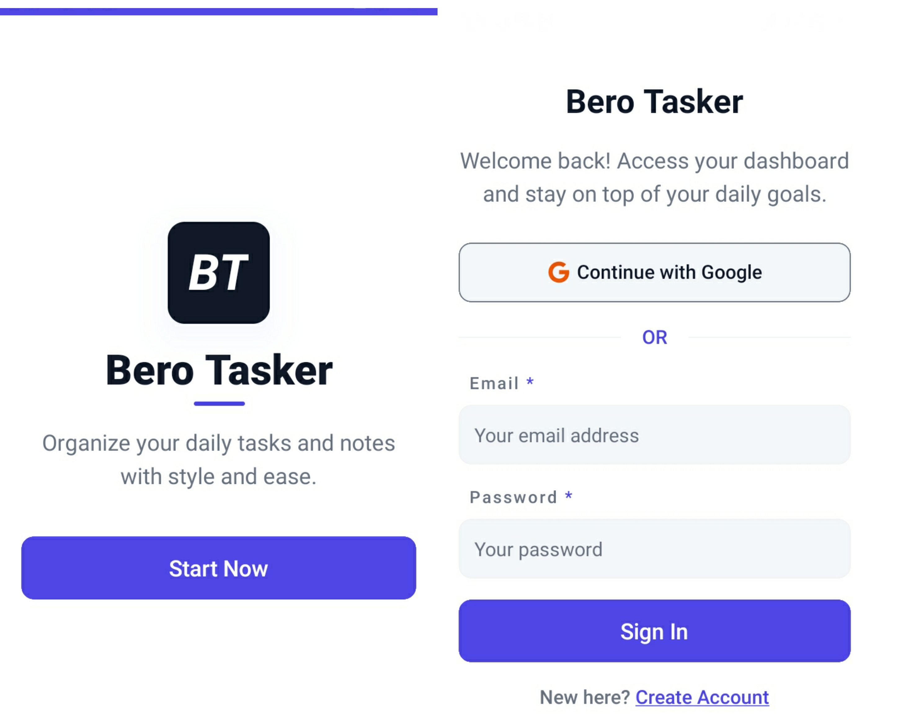
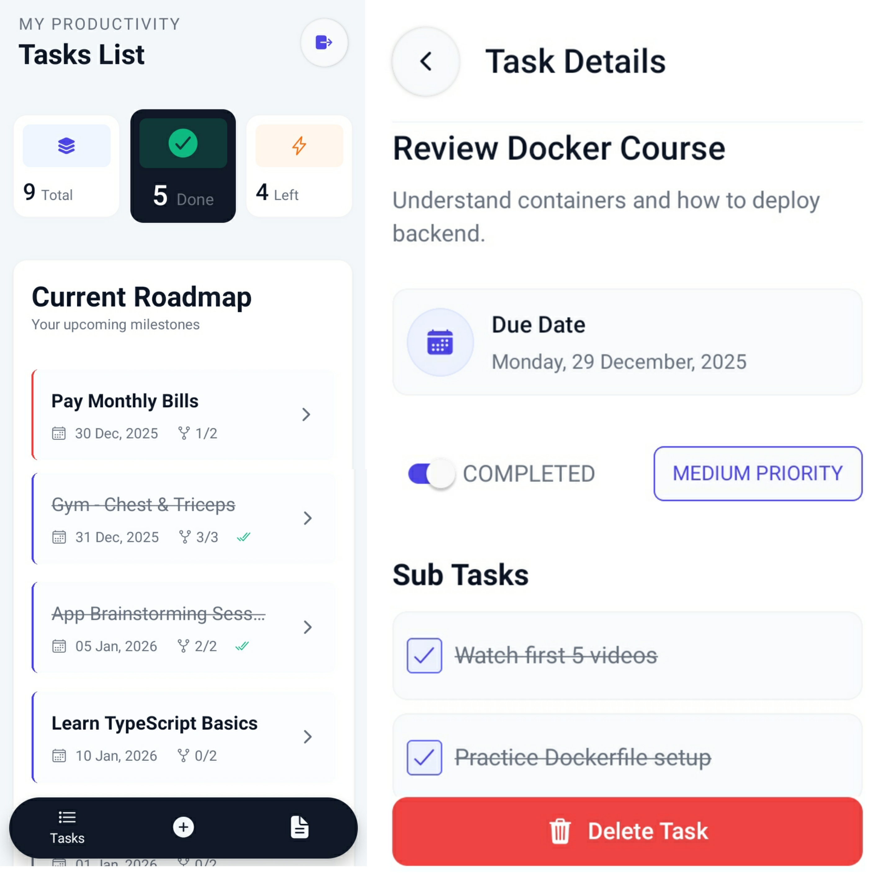
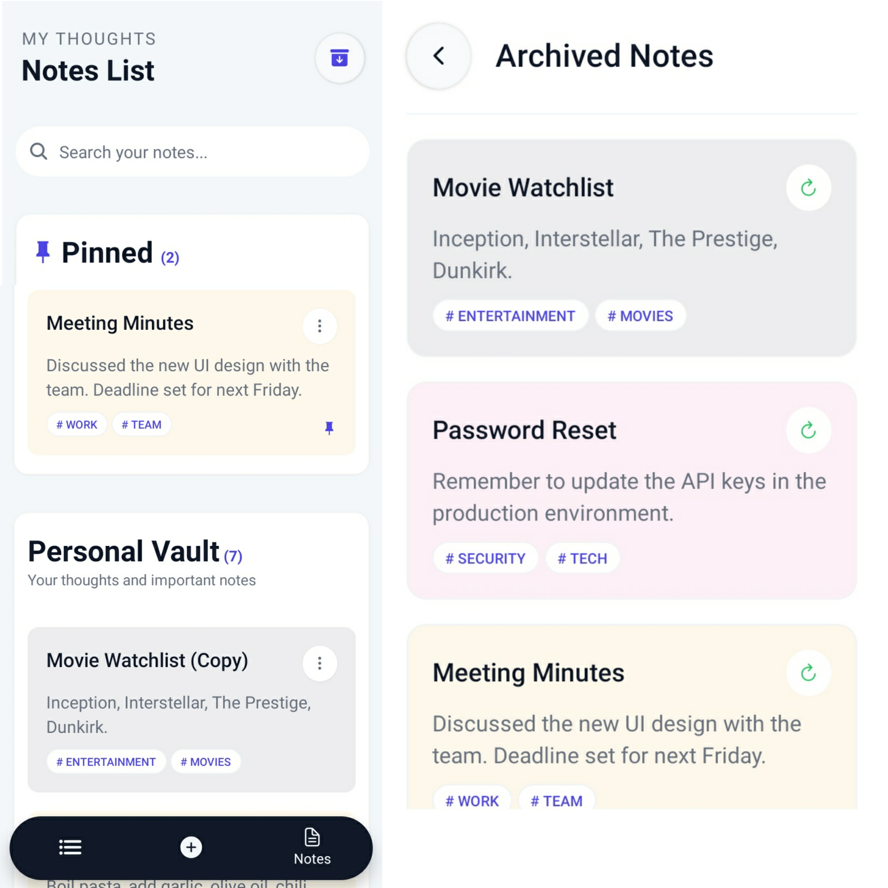
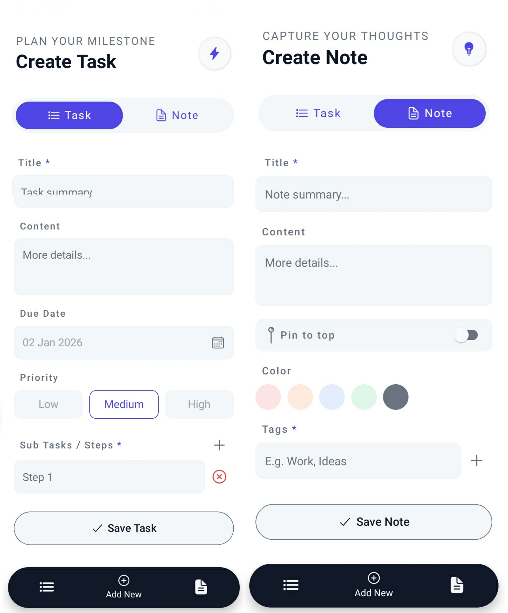

# 📱 Bero Tasker - Mobile App

A modern, high-performance mobile application for managing **Tasks and Notes**. Built with **React Native** and **Expo**, featuring a seamless user interface and secure authentication.

---

> [!IMPORTANT]
> **📺 Watch the Demo:** Check out the **[App Demo Video](https://youtu.be/BExEKLQOeNY)** to see **Bero Tasker** in action, showcasing the smooth UI, Task/Note management, and priority sorting.

---

## ✨ Features

* **Dual Management:** Organize both your daily tasks and personal notes in one place.
* **Secure Authentication:** User login and signup powered by **Clerk**.
* **Smart Sorting:** Tasks are automatically organized by priority and due date.
* **Modern UI/UX:** Styled with **Tailwind CSS (NativeWind)** for a clean and responsive look.
* **RTL Support:** Optimized layout for a consistent experience.
* **Deep Linking:** Configured for seamless navigation and authentication redirects.

---

## 🛠 Tech Stack

* **Framework:** React Native (Expo SDK)
* **Routing:** Expo Router (File-based routing)
* **State & Auth:** Clerk (Authentication & User Management)
* **Styling:** NativeWind (Tailwind CSS for React Native)
* **HTTP Client:** Axios for API communication

---

## 📂 Project Structure

```text
├── app/            # Main application screens and navigation (Expo Router)
├── components/     # Reusable UI components
├── assets/         # Images, fonts, and static resources
├── api/            # API services and Axios configurations
├── types/          # TypeScript interfaces and type definitions
├── utils/          # Helper functions and utility constants
└── app.json        # Expo configuration
```

---

## 🚦 Getting Started
**1. Prerequisites**
* Node.js & npm/yarn installed.
* Expo Go app installed on your physical device or an Emulator.

**2. Installation**
* Clone the repository and install dependencies:

```
git clone https://github.com/ibrahimdayoub/tasker-frontend.git
cd tasker-frontend
npm install
```

**3. Environment Variables**
* Create a .env file in the root directory and add:

```
EXPO_PUBLIC_API_URL=your_api_url
EXPO_PUBLIC_CLERK_PUBLISHABLE_KEY=your_publishable_key
```

**4. Run the App**

```
npx expo start
```
Scan the QR code with your Expo Go app to see it in action.

---

## 📌 Screenshots






---

## 🔗 Related Project
This mobile app is powered by the **[Bero Tasker Backend API](https://github.com/ibrahimdayoub/tasker-backend)**
